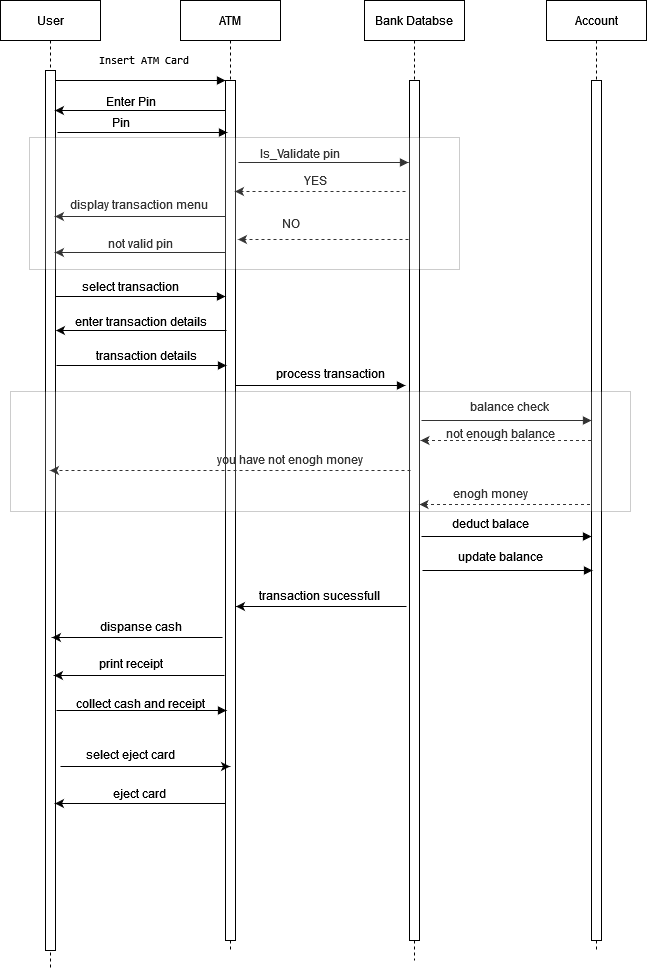

# Class Assignment 
Draw a UML Sequence Diagrams for ATM Machine

# Technical Report

## Introduction

The Automated Teller Machine (ATM) is an integral part of modern banking, providing customers with convenient access to various banking services. This report outlines the operation of a simplified ATM system, featuring a UML sequence diagram and the standard operating process.

## UML Sequence Diagram

**Description of the UML Sequence Diagram:**

1. **User**: Initiates the transaction by inserting their ATM card into the machine.

2. **ATM**: Requests the user's Personal Identification Number (PIN) for authentication.

3. **User**: Enters their PIN.

4. **ATM**: Sends the PIN to the bank's database for validation.

5. **Bank Database**: Validates the PIN and responds to the ATM.

6. **ATM**: Displays transaction options to the user, such as cash withdrawal or balance inquiry.

7. **User**: Selects a transaction type (e.g., cash withdrawal).

8. **ATM**: Prompts the user to provide transaction details (e.g., withdrawal amount).

9. **User**: Enters transaction details.

10. **ATM**: Sends the transaction request to the bank's database for processing.

11. **Bank Database**: Processes the transaction, deducts the requested amount, and updates the account balance.

12. **Bank Database**: Sends a response to the ATM, indicating the success of the transaction.

13. **ATM**: Dispenses the requested cash to the user.

14. **ATM**: Prints a transaction receipt for the user.

15. **User**: Collects the cash and the receipt.

16. **User**: May choose to perform additional transactions.

17. **ATM** repeats the process for new transaction requests.

18. **User**: Concludes the session by ejecting their ATM card.

## Operating Process

The typical ATM operating process involves user authentication through a Personal Identification Number (PIN), transaction selection, transaction details entry, communication with the bank's database, and successful transaction completion.

## Concluding Remarks

The ATM machine system plays a pivotal role in banking, simplifying access to financial services. In practice, real-world ATM systems entail additional complexities and security measures to ensure the safety and reliability of customer transactions.
